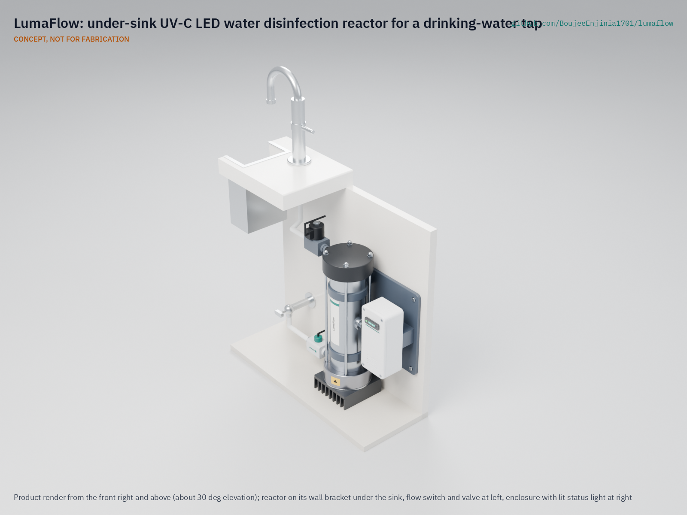

# LumaFlow

  

**Area:** Water Security · **TRL:** 3 of 9 (proof of concept on paper) · **Prototype budget:** $340 USD · **Difficulty:** 2 of 5

Inline UV-C LED reactor with a flow-activated switch and a dose monitor, sized for a household tap.

[Exploded render](media/render-exploded.png) · [Detail render](media/render-detail.png) · [Interactive 3D model](media/viewer.html) · [Concept blueprint (PDF)](media/concept-blueprint.pdf) · [General arrangement (PDF)](cad/drawings/LMF-DWG-001.pdf) · [Calculations](docs/04-calcs/01-sizing.md) · [Review note](docs/REVIEW.md)

## Concept rationale

A UV-C LED reactor that runs only while water flows turns the LED's main weakness, low efficiency, into a small cost: at a household's few minutes of use a day, six LEDs use about 3.8 kWh a year, where a mercury lamp left on all day uses 114 to 193 kWh. Shining the LEDs along a wide, reflective tube, rather than wrapping lamps around a sleeve, keeps the part count low and puts every LED behind one flat quartz window that is easy to seal and service. A photodiode in the tube wall and a normally closed valve mean that a weak dose stops the water rather than passing it silently.

The design is open and garage-buildable because the people who most need point-of-use disinfection, households on private wells and small water projects, are the least served by closed commercial units. Every dimension, dose calculation and part is published, so a university lab, a maker space or a water charity can build one from catalog LEDs, a stainless tube, a machined end cap and push-fit plumbing, test it and improve it.

## Burning platform

Unsafe water remains one of the largest preventable causes of illness. In 2022, 2.2 billion people lacked safely managed drinking water, and at least 1.7 billion used a source contaminated with faeces; microbiologically contaminated drinking water is estimated to cause about 505,000 diarrhoeal deaths each year ([WHO drinking-water fact sheet](https://www.who.int/news-room/fact-sheets/detail/drinking-water)).

The gap is not confined to low-income countries. More than 43 million people in the United States, about 15 % of the population, rely on private domestic wells whose water quality is not regulated by the federal Safe Drinking Water Act ([USGS](https://www.usgs.gov/mission-areas/water-resources/science/domestic-private-supply-wells)), and an estimated three to four million Canadians are served by private supplies ([CMAJ, 2010](https://www.cmaj.ca/content/182/10/1061)). Each of those households is its own water utility, usually without monitoring.

## Where it could be used

### By industry

| Industry | Use |
| --- | --- |
| Residential water treatment | Point-of-use disinfection at a kitchen drinking-water tap on a private well or rainwater tank |
| Rural health clinics | A low-maintenance disinfection stage for the tap used for drinking and hand hygiene |
| Schools and community water points | A metered, monitored barrier on an indoor drinking tap, with a visible fault light |
| Humanitarian and development programs | An open reference design that local workshops can build and repair |
| Research and education | A test bed for reactor optics, LED aging and dose sensing |
| Recreational and off-grid buildings | Cabins, boats and camps on untreated supplies, with 24 V DC power |

### By country or region

| Country or region | Why it matters there |
| --- | --- |
| United States | More than 43 million people drink from private wells outside federal drinking-water regulation ([USGS](https://www.usgs.gov/mission-areas/water-resources/science/domestic-private-supply-wells)) |
| Canada | Three to four million people, about one in eight, are served by private supplies ([CMAJ](https://www.cmaj.ca/content/182/10/1061)) |
| Sub-Saharan Africa | The gap between urban and rural coverage of safely managed drinking water, 38 percentage points in 2022, is the widest of any region ([WHO and UNICEF JMP, 2023, p. 14](https://cdn.who.int/media/docs/default-source/wash-documents/jmp-2023_layout_v3launch_5july_low-reswhowebsite.pdf)); rural households and clinics are the users a small, flow-switched unit serves |
| Bangladesh | In the national Multiple Indicator Cluster Survey of 2019, children in households whose drinking water carried high *E. coli* contamination were 2.28 times as likely to have diarrhea as those in low-risk households ([Khan et al., 2022](https://link.springer.com/article/10.1007/s11356-021-18460-9)) |
| Latin America and the Caribbean | The gap between urban and rural coverage of safely managed drinking water, 27 percentage points in 2022, is second only to sub-Saharan Africa ([WHO and UNICEF JMP, 2023, p. 14](https://cdn.who.int/media/docs/default-source/wash-documents/jmp-2023_layout_v3launch_5july_low-reswhowebsite.pdf)) |
| Pacific islands (Oceania) | At least basic drinking water reached 93 % of urban but only 51 % of rural people in 2022 ([WHO and UNICEF JMP, 2023, p. 14](https://cdn.who.int/media/docs/default-source/wash-documents/jmp-2023_layout_v3launch_5july_low-reswhowebsite.pdf)); a unit that runs on 24 V DC suits off-grid homes |

## What sparked the idea

The idea traces back to one of the first patents on ultraviolet water sterilization, filed on 7 June 1910 by Victor Henri, André Helbronner and Max von Recklinghausen ([US 1,151,267](https://patents.google.com/patent/US1151267)). Their apparatus kept a quartz mercury-vapor lamp outside the water, ran the liquid past it and lined the channel with reflecting metal "so that the rays which pass through the liquid are caused to re-traverse the same." LumaFlow keeps that arrangement, a light source behind a quartz window and a reflective channel, and swaps the mercury lamp for UV-C LEDs that switch on only when water flows.

## Problem

Point-of-use disinfection often depends on mercury UV lamps that break.

## Concept

Water flows up a stainless tube lined with high-reflectance PTFE (50 mm bore, 242 mm water column) while six 275 nm UV-C LEDs at the bottom shine up through a quartz window. A flow sensor switches the LEDs on only while water runs, and a UV-C photodiode in the tube wall estimates the dose; if it falls too low, a normally closed valve shuts off the water and an alarm sounds. The TRL 3 calculations ([LMF-CAL-001](docs/04-calcs/01-sizing.md)) give a dose of 52 to 76 mJ/cm² at the 1.2 L/min (0.32 gpm) design flow in clear water (90 %/cm UV transmittance), above the 40 mJ/cm² target, and 17 to 22 mJ/cm² in the 70 %/cm test water, which stays below it. The unit draws 22.6 W while flowing and 0.21 W on standby. The parts cost $338 against the $340 budget that Amish approved on 2026-09-26 (see the [review note](docs/REVIEW.md)).

Full design precis: [docs/02-concept.md](docs/02-concept.md)

## Key components

- Six 275 nm UV-C LEDs on a heat sink with a board temperature sensor, cooled through a 316 stainless lower end cap into the water
- 316 stainless reactor tube with a high-reflectance PTFE liner (50 mm bore) and top disc; acetal upper cap shielded from UV-C
- Fused quartz window (57 x 10 mm) between the LEDs and the water
- Hall-effect flow sensor (15 Hz per L/min) acting as the flow switch
- UV-C photodiode dose monitor in the tube wall at mid height
- Controller with constant-current LED driver, normally closed shutoff valve, external 24 V adapter
- At installation: a sediment pre-filter and a pressure-limiting valve at 4 bar (58 psi) or less

The priced bill of materials is in [bom/bom.csv](bom/bom.csv); the parametric model is `cad/src/model.py`, with STEP and STL exports in `cad/step/` and `cad/stl/`.

## Safety

> UV-C light damages eyes and skin. Interlock the housing so LEDs cannot run when open. LumaFlow is a research and educational prototype, not a certified water treatment device, and its dose is calculated, not measured; do not rely on it as a barrier for drinking water. See the safety section of the [design precis](docs/02-concept.md).

## Repository layout

| Folder | Contents |
| --- | --- |
| `docs/` | Problem, concept, requirements, calculations and design decisions |
| `cad/src/` | build123d Python source, the source of truth for all geometry |
| `cad/step/`, `cad/stl/` | Exported models for FreeCAD, other CAD tools and printing |
| `cad/drawings/` | 2D sketches and dimensioned drawings |
| `bom/` | Bill of materials |
| `electronics/` | KiCad schematics and PCB layouts |
| `firmware/` | Microcontroller code |
| `media/` | Renders, perspectives and photos |
| `build-log/` | Dated prototyping notes |

## Documentation

Controlled documents follow the portfolio [documentation standard](.kit/STANDARDS.md). Each carries a document ID (LMF-PRC-001 for the precis), a version and a revision history. Branded PDFs are built with `python .kit/render.py` and attached to GitHub Releases when a document is tagged, for example `LMF-PRC-001/v1.0`.

## Credits

Designed by Amish Chadha. See [CONTRIBUTORS.md](CONTRIBUTORS.md) for roles. To cite this design, use [CITATION.cff](CITATION.cff) (GitHub shows it as "Cite this repository").

AI assistance (Claude) was used to accelerate concept renders, prototype documentation and first-pass sizing calculations. Design direction and all decisions are Amish Chadha's, recorded in this repository's decision records (`docs/decisions/`).

## Licenses

- **Hardware** (CAD, drawings, BOM, electronics): [CERN-OHL-S v2](LICENSE)
- **Software** (firmware, scripts, notebooks): [MIT](LICENSE-SOFTWARE)

A project of the [Design Molecule](https://designmolecule.com) lab.
