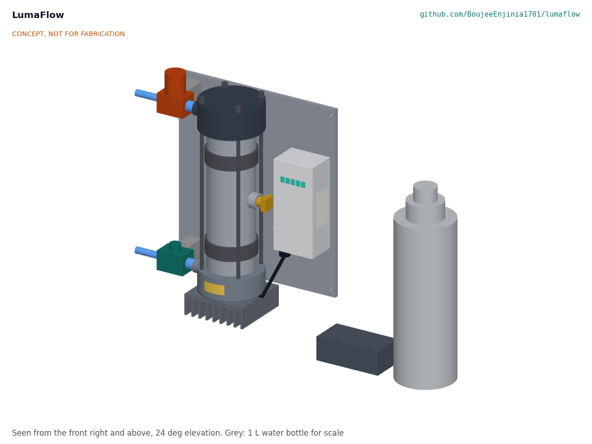
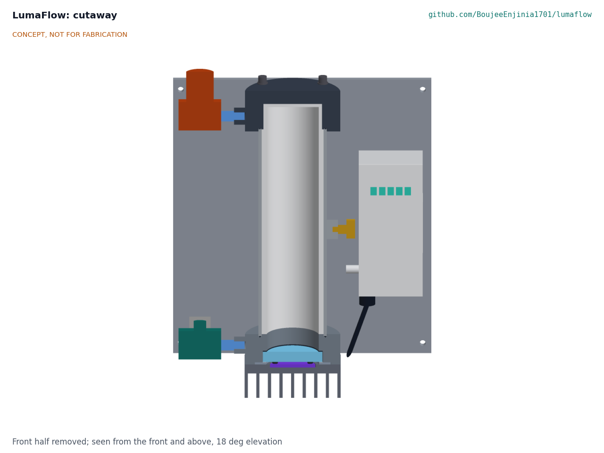
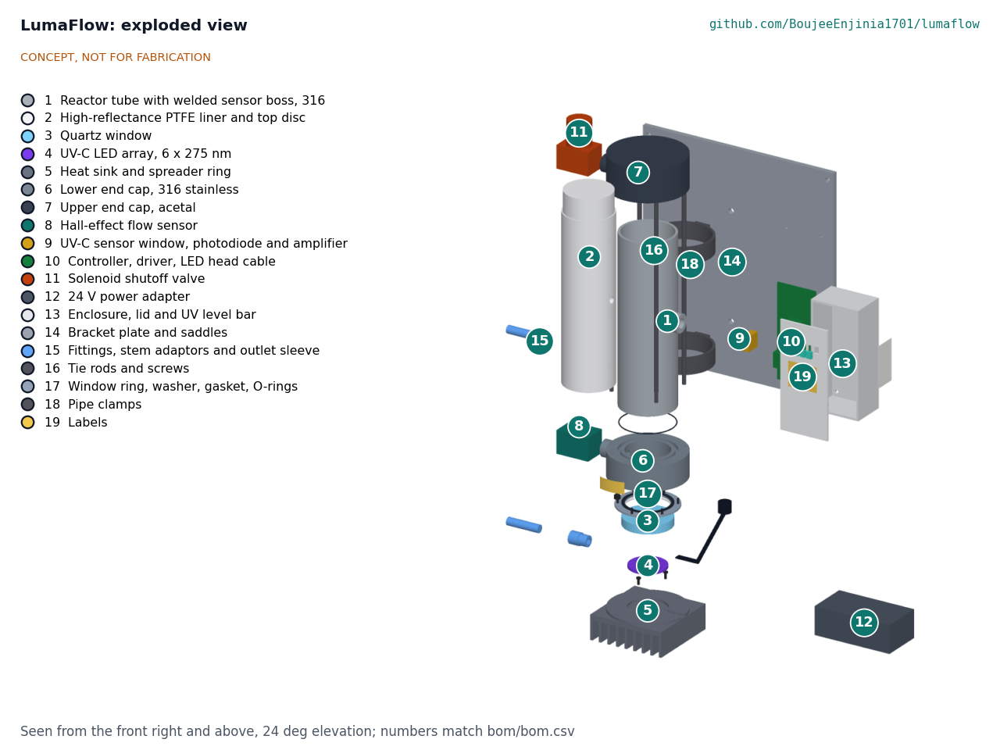
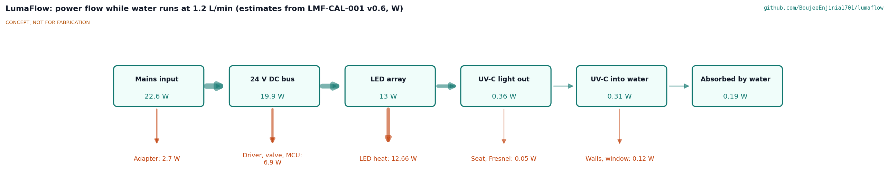

# LumaFlow design precis

## Summary

LumaFlow is an inline UV-C LED reactor with a flow-activated switch and a dose monitor, sized for a household tap. Water flows up a stainless tube lined with high-reflectance PTFE, with a 50 mm bore, while six 275 nm LEDs at the bottom shine up a 242 mm water column through a quartz window. A Hall-effect flow sensor turns the LEDs on only while water runs, and a UV-C photodiode in the tube wall at mid height measures the light in the water, which lets the controller estimate the dose and close a valve if it falls too low.

The first TRL 3 calculation (LMF-CAL-001 v0.1) showed that the original 25 mm bore lost half of the light to the wall and delivered only 14.7 to 19.0 mJ/cm² at 2 L/min. Amish accepted the recommended route on 2026-09-25 (LMF-DDR-002): a wider bore, a higher-reflectance liner and a modest flow cut. With a 50 mm bore, a liner reflectance of 0.95 and a design flow of 1.2 L/min (0.32 gpm), the reduction equivalent dose (RED) in clear water (90 %/cm UV transmittance) is 50.9 to 74.9 mJ/cm², so **R2 is met**. At the 70 %/cm test condition it is 17.0 to 21.3 mJ/cm² (**R3 not met**, accepted by decision D1). The unit draws 22.6 W while water flows and 0.21 W on standby. Value-engineering target: USD 340. Estimated cost of the constructable design: USD 416 (USD 76 over the target). The design was made physically buildable on 2026-10-01 (LMF-DDR-003, accepted by Amish on 2026-10-02 with the window seat changed to a PTFE washer), and the prototype build plan LMF-BLD-001 shows how to make and fit every part.

*Figure 1. LumaFlow model, mounted on its wall bracket under a sink, with the 24 V adapter on the cabinet floor. The grey 1 L bottle is for scale.*

## How it works

1. **Flow starts.** When someone opens the drinking-water faucet, water enters through the Hall-effect flow sensor (item 8). Its pulses, 15 per second for each L/min, tell the controller that flow has started and how fast it is.
2. **LEDs on.** The controller opens the normally closed outlet valve (item 11) and drives the six 275 nm LEDs (item 4) at 350 mA. At the 0.3 L/min threshold the first sensor pulse arrives within 0.22 s, so switch-on takes up to 0.24 s against the 0.5 s target (LMF-CAL-001, D2). LEDs reach full output almost at once, so no warm-up or bypass is needed.
3. **Irradiate.** The LEDs sit 1.3 mm under a 10 mm fused quartz window (item 3), which rests on a 0.5 mm PTFE washer on its stainless retaining ring, in the 316 stainless lower end cap (item 6). Water enters the lower cap just above the window, flows up the 50 mm bore of the PTFE liner (item 2) at about 1 cm/s and leaves through a 316 insert in the acetal upper cap (item 7) after about 22 s. The wide bore lets light cross more water between wall reflections, and the liner returns about 95 % of the light that reaches it, so the water absorbs 53 % of the LED output at 90 %/cm.
4. **Measure.** A UV-C photodiode (item 9) behind an 8 mm quartz window in the tube wall at mid height sees the light in the water. Its signal falls if the water's UVT drops, the liner or window fouls or the LEDs age. The controller combines that reading with the flow rate to estimate the dose, using a proportional rule that blames every loss of signal on the LEDs, which always under-reads (LMF-CAL-001, C3 to C5).
5. **Alarm and shut off.** If the estimated dose falls below 40 mJ/cm², the flow exceeds its limit, a sensor fails or the enclosure lid is opened, the controller closes the valve, sounds the buzzer and shows the fault on the UV level bar. In normal running the five-segment bar shows the UV level relative to the alarm threshold, read from the wall sensor (R18); it is not a dose reading. With fresh LEDs this happens below about 89 %/cm UVT. The valve also closes if power is lost, so no untreated water passes silently.
6. **Stay cool.** A temperature sensor on the LED board lets the controller cut LED current above 50 °C. A cut-back lowers the dose, which the photodiode sees, so the alarm rule still protects the user.
7. **Flow stops.** The LEDs stay on for 5 s after flow stops, then everything switches off.

*Figure 2. Cutaway through the reactor axis, looking at the wall. From the bottom: heat sink, LED board, quartz window in the stainless lower cap with the inlet, the 50 mm PTFE-lined tube with the wall photodiode on the right, and the PTFE top disc in the acetal upper cap with the outlet insert. The controller board is in the enclosure on the right.*

## Main components

Numbers match the exploded view (Figure 3), `bom/bom.csv` and drawing LMF-DWG-001 Rev P4.

Table 1. Main components.

| # | Component | Choice | Notes |
| --- | --- | --- | --- |
| 1 | Reactor tube | 316 stainless, 65 mm OD x 3 mm wall x 200 mm, one hole for the sensor window | Carries pressure and blocks all UV-C |
| 2 | High-reflectance PTFE liner and top disc | Sintered or expanded PTFE tube, 50 mm bore, 224 mm long, and a solid 3 mm top disc | Water channel and diffuse reflector (0.95 assumed); shields the acetal cap |
| 3 | Quartz window | UV-grade fused silica, 57 mm diameter x 10 mm, on a 51 mm seat | 6.18 MPa at 8 bar (LMF-CAL-001, G4) |
| 4 | UV-C LED array | Six 275 nm LEDs on a 32 mm circle, about 60 mW each at 350 mA, on one 44 mm aluminum-core board with an NTC temperature sensor | Decision D4; NTC for the thermal cut-back |
| 5 | Heat sink and spreader ring | Finned aluminum sink 90 x 90 x 30 mm and a 90 mm spreader ring to the stainless cap | Water carries 9.0 of 12.7 W of heat |
| 6 | Lower end cap | 316 stainless, 90 mm diameter x 30 mm, LED aperture, window seat, 3/8 in inlet | Stainless because its bore sees full UV-C and it is the water-cooled heat path (confirmed, LMF-DDR-002) |
| 7 | Upper end cap | Acetal, 90 mm diameter x 30 mm, liner pocket, outlet boss | Sees no UV-C behind the PTFE and the 316 insert |
| 8 | Hall-effect flow sensor | Food-grade, 0.3 to 6 L/min, 15 Hz per L/min or more | Switch and meter (decision D5) |
| 9 | UV-C wall photodiode and amplifier | SiC photodiode with transimpedance amplifier behind an 8 mm quartz window in the tube wall, on a clamp-on saddle | Dose monitor at mid height (LMF-DDR-002) |
| 10 | Controller and LED driver | Microcontroller, 350 mA constant-current driver with dimming, valve driver, NTC input, input fuse | Module-based; no custom PCB |
| 11 | Solenoid shutoff valve | 24 V DC, normally closed, food-grade | Closes on alarm or power loss (decision D6) |
| 12 | 24 V power adapter | Certified external adapter, 30 W | The only part at mains voltage (decision D8) |
| 13 | Electronics enclosure | Printed PETG body and lid, lid interlock, five-segment UV level bar on the lid (R18), buzzer, socket for the LED head plug, back screwed to the bracket plate | Dry side only. The LED head plug carries an interlock loop (R12); UV-C warning labels sit inside the lid and on the lower cap, and the product label on the enclosure side (item 19) |
| 14 | Wall bracket | 6 mm aluminium plate with two printed saddles for the flow sensor and valve | Holds the reactor vertical (decision D7) |
| 15 | Fittings, stem adaptors and outlet sleeve | 3/8 in push-fit, stainless stem adaptors in 1/4 BSPP ports, tee to the cold line, 1.2 L/min restrictor, 316 outlet sleeve | Restrictor enforces R1 |
| 16 | Tie rods and hardware | Four M5 316 studs on an 80 mm circle, threaded into the lower cap | 664 N each at 8 bar (G7) |
| 17 | Window retaining ring and seals | 316 ring under the window, EPDM window gasket, two EPDM face O-rings at the tube ends | Added by LMF-DDR-003 |
| 18 | Pipe clamps | Two rubber-lined 65 mm clamps on M8 studs | Added by LMF-DDR-003 |

Not in the BOM, but required at installation: a 5 µm sediment pre-filter and a pressure-limiting valve set at 4 bar (58 psi) or less (R17).

*Figure 3. Exploded view with numbered callouts matching the BOM.*

## Key numbers

Every number in this section comes from LMF-CAL-001 v0.6, which states the assumptions; the tag in brackets is the line of `docs/04-calcs/sizing.py` that prints it.

### Flow

The channel is 50 mm across and 242 mm long and holds 474 mL [A1, A2]. At 1.2 L/min the mean velocity is 1.02 cm/s, the residence time between the ports 22.2 s and the Reynolds number 507, so the flow is laminar [A3, A4]. The entrance length is far longer than the tube [A5], so the true profile lies between plug flow and a parabola; the dose is given for both.

### UV-C dose

Table 2. Dose at 1.2 L/min [B3 to B6].

| Quantity | 90 %/cm UVT (design water) | 70 %/cm UVT (NSF/ANSI 55 test water) |
| --- | --- | --- |
| UV-C entering the water | 84.8 % of 0.36 W | 84.8 % of 0.36 W |
| UV-C absorbed by the water | 52.9 % | 66.5 % |
| Lost at the walls | 25.9 % | 16.4 % |
| Average dose | 75.4 mJ/cm² | 21.5 mJ/cm² |
| **RED (laminar to plug flow)** | **50.9 to 74.9 mJ/cm²** | **17.0 to 21.3 mJ/cm²** |
| Requirement | **R2 met** | **R3 not met** (accepted by D1) |

The liner reflectance is the main optical uncertainty: plain PTFE (0.80) would give 45.2 mJ/cm² and 0.90 gives 48.7 [B8]. LEDs 20 % below rating give 40.7 mJ/cm² [B9]. Six LEDs in this reactor reach 40 mJ/cm² up to 1.56 L/min, and 40 mJ/cm² with a 20 % margin up to 1.26 L/min [J1].

The dose target is the NSF/ANSI 55 Class A dose level for context only ([Fresh Water Systems](https://www.freshwatersystems.com/blogs/blog/nsf-class-a-and-class-b)). 40 mJ/cm² inactivates common bacteria and *Cryptosporidium* by several logs, but adenovirus needs about 186 mJ/cm² for 4 logs ([EPA UV toolkit](https://www.epa.gov/system/files/documents/2022-05/uv-toolkit-815-B-21-007_0.pdf)), so LumaFlow would not be a full virus barrier even at its target. Published flow-through LED reactors show that the reactor layout changes the delivered dose a great deal ([flow-through reactor efficiency](https://www.sciencedirect.com/science/article/abs/pii/S2214714420306966); [cylindrical reactor optimization](https://www.sciencedirect.com/science/article/abs/pii/S2213343724004962)).

### Dose monitor

The wall photodiode gives about 13.4 nA at 90 %/cm, 2.4 nA at 80 %/cm and 0.19 nA at 70 %/cm [C1], and its signal falls 2.6 times as fast as the dose [C2]. With the proportional mapping the alarm threshold is S/S_ref = 0.79 [C3]: it trips below about 89 %/cm with fresh LEDs, or when the LEDs have aged to 79 % of output in 90 %/cm water [C4]. R4 is at risk until the mapping and the 1 s fail-safe are shown in firmware and test. The five-segment UV level bar shows three segments in 90 %/cm water with fresh LEDs and loses its last segment where the alarm trips, so R18 is met [C6].

### Power and energy

Table 3. Power and energy [E1 to E6].

| Quantity | Value | Requirement |
| --- | --- | --- |
| LED electrical power | 13.02 W | |
| Power from mains while flowing | 22.6 W | R9 met (25 W) |
| Standby power | 0.21 W | R9 met (0.5 W) |
| LED on-time | 14.2 min/day, 86 h/year flowing; 92 h/year with the idle pulse of about 10 s every 4 h | 10,000 h in 108 years |
| Energy | 10.4 Wh/day flowing, 0.28 Wh/day for the idle pulse; 3.9 kWh/year | |
| Tap-scale mercury unit of 13 to 22 W running all day ([VIQUA spec sheet](https://viqua.com/wp-content/uploads/LIT520326_SpecSheet.pdf)) | 114 to 193 kWh/year | For comparison |

*Figure 4. Power flow while water runs at 1.2 L/min. All values are estimates from LMF-CAL-001, in watts.*

### Heat

The LEDs turn 12.66 W into heat. The spreader ring passes it into the stainless lower cap, whose wetted bore gives it to the water (8.9 W; the water warms by 0.11 K), and the finned sink gives the rest to the air [F1, F2]. With continuous flow the LED board settles at 37.3 to 45.1 °C over the range of water-film coefficients, 40.5 °C nominal, so R10 is met [F3]. The board sensor cuts LED current above 50 °C as a backstop. With the LEDs stuck on and no flow the board heads for 53 °C [F6], where the cut-back acts; the controller must also switch the LEDs off when flow stops. A 10 s idle pulse warms the still head by 0.16 K [F7].

### Pressure and structure

The unit drops 0.15 bar at 1.2 L/min, not counting the restrictor, against 0.5 bar (R8 met, on assumed flow coefficients) [G2]. The 10 mm window carries 6.18 MPa at 8 bar against a design stress of 6.8 MPa (1,000 psi) for fused quartz ([Momentive](https://www.momentivetech.com/materials/fused-quartz-materials/quartz-properties/mechanical-properties)); R7 is met [G4]. An unprotected 16 bar spike would give 12.4 MPa, so the installation needs a pressure-limiting valve at 4 bar or less (R17), which keeps a transient of twice the setting at 6.18 MPa [G5]. Four M5 rods carry the 2,655 N end load [G7]. The window sits on a 0.5 mm PTFE washer whose 51 mm bore matches the retaining ring, so the open span and the stress are unchanged.

### Size and cost

The unit is 277 x 100 x 322 mm without the adapter, inside R14 [H1], and weighs about 5.0 kg dry and 5.4 kg full of water [H2]. Value-engineering target: USD 340. Estimated cost of the constructable design: USD 416 (USD 76 over the target) [I1]; the LEDs ($54), the stainless lower cap ($48) and the high-reflectance liner ($45) are the largest lines.

## Key design choices

Items marked "Decided" were decided by Amish on 2026-09-25, going with the recommendation (LMF-DDR-001, D1 to D9, and LMF-DDR-002, E1 to E8).

- **Axial LED head with a flat window (Decided, D3).** LEDs at one end shine along the tube through a flat window; this uses few LEDs and a simple reflector.
- **Wide bore, high-reflectance liner and 1.2 L/min (Decided, LMF-DDR-002).** A 50 mm bore with a liner of reflectance 0.95 and a modest flow cut close the dose gap found in LMF-CAL-001 v0.1. Lowering the flow alone (to about 0.6 L/min in the old reactor) is the fallback.
- **Wall dose sensor (Decided, LMF-DDR-002).** The photodiode moved from the top disc to the tube wall at mid height, with the proportional mapping kept. A second reference sensor near the LEDs, to separate LED aging from water quality, remains an optional idea.
- **275 nm LEDs (Decided, D4).** 275 nm gives the most UV-C output per dollar ([Tech-LED](https://tech-led.com/uv-c-leds-for-disinfection-and-sterilization-component-selection-265-280-nm/)); prices to be revisited. The dose calculation takes the organism's response at 275 nm as equal to that at 254 nm, which must be checked.
- **Design water quality and dose target (Decided, D1).** Design for 90 %/cm UVT, alarm and close the valve below 40 mJ/cm², and keep R3 visibly not met; flow limiting in poor water (Option C) is a later upgrade.
- **Flow sensor as the switch (Decided, D5), at 15 Hz per L/min or more (Decided, LMF-DDR-002).**
- **Normally closed outlet valve (Decided, D6).** Fails closed on alarm and on power loss.
- **Vertical mounting, flow upward (Decided, D7).** Purges air bubbles from under the window.
- **External 24 V adapter (Decided, D8).** Certified adapter on a GFCI or RCD-protected outlet.
- **End caps (Decided, LMF-DDR-002).** 316 stainless lower cap for UV-C exposure and heat, acetal upper cap shielded by the PTFE liner, top disc and a 316 outlet insert.
- **Pressure limiter and thermal cut-back (Decided, LMF-DDR-002).** A pressure-limiting valve upstream is an installation requirement (R17); a board temperature sensor cuts LED current above 50 °C (R10).
- **Budget (Decided, D2, and LMF-DDR-002).** `budget_usd` was $225. The recommendation to hold the budget until the dose route was chosen and then re-price has been carried out: the re-priced BOM is $338.00. Budget top-up to $340: decided by Amish, 2026-09-26 (LMF-DDR-002, O4); `budget_usd` is now $340.

## Safety

> **Safety:** LumaFlow emits UV-C light that injures eyes and skin, sits under pressure next to mains power in a wet cabinet, and is meant to make water safe to drink. Its dose is calculated, not measured. It is a research and educational prototype, not a certified water treatment device. Do not rely on it as a barrier for drinking water.

- **UV-C exposure.** UV-C burns the cornea and skin within seconds to minutes at close range and is invisible. The stainless tube, stainless lower cap, sealed sensor boss and PTFE-shielded upper cap block all UV-C in normal use. An interlock on the enclosure lid (a reed switch) and on the LED head (a loop in the head's plug, on a cable too short for the head to come off while plugged in) cuts LED power when either is opened, and no one should look into the bore, window or sensor port while the LEDs can run. Any bench work needs UV-C blocking eyewear and covered skin.
- **False sense of safety.** The calculated dose of 50.9 to 74.9 mJ/cm² at 90 %/cm rests on an assumed liner reflectance and organism response and has not been measured. In poorer water the dose falls quickly (17.0 mJ/cm² at 70 %/cm). UV does not remove chemicals, lead, nitrate or particles, leaves no residual disinfectant, and works poorly in cloudy or iron-rich water. A dose below target must stop the water, not only warn. Downstream pipework and the faucet can grow biofilm.
- **Pressure and leaks.** Supply pressure acts on the window, caps, sensor window and tubing; the larger window has a 9 % margin at 8 bar, and an unprotected spike would overstress it. Fit a shutoff valve and a pressure-limiting valve at 4 bar or less upstream. A cracked window would flood the LED head; the board runs at 24 V, so the hazard is short circuit and loss of treatment rather than shock. The fuse on the 24 V input and a leak check in the fault logic are required.
- **Electrical.** Mains is confined to the certified adapter, which should plug into a GFCI or RCD-protected outlet above any likely water level in the cabinet.
- **Heat.** The board temperature sensor cuts LED current above 50 °C, and the controller must switch the LEDs off when flow stops.
- **Materials.** UV-C degrades most plastics; only PTFE, quartz and metal may see it. Every wetted part must be food-contact grade.

## Open questions

- [x] Design water quality and dose target (decided, D1).
- [x] Estimate the reactor efficiency for this axial, laminar geometry (LMF-CAL-001: 0.67 laminar in the 50 mm bore).
- [x] Choose a route to close R2 (decided, LMF-DDR-002: 50 mm bore, 0.95 liner, 1.2 L/min).
- [x] Move the dose sensor to the tube wall (decided, LMF-DDR-002).
- [x] Confirm the end cap materials (decided, LMF-DDR-002).
- [x] Set the budget figure for the $338.00 BOM: $340, decided by Amish, 2026-09-26.
- [ ] Measure the wetted reflectance of the liner at 275 nm, and the organism response at 275 nm (TRL 4, on hold).
- [ ] Confirm the flow coefficients of the sensor and valve (R8) and the water-film coefficient in the lower cap (R10).
- [x] Idle LED pulse: a firmware rule runs the LEDs for about 10 s every 4 h of idle, with both interlocks and the valve logic unchanged; plate counts at TRL 4 check its effect. Decided by Amish, 2026-10-02 (LMF-DEC-001).
- [ ] Partner with real well-water UVT data: a university extension programme for private well owners, with the Texas A&M AgriLife Extension Texas Well Owner Network as the first candidate to approach. Decided by Amish, 2026-10-02 (LMF-DEC-001).

Concept media: [blueprint sheet](../media/concept-blueprint.pdf), [interactive 3D model](../media/viewer.html). General arrangement: [LMF-DWG-001](../cad/drawings/LMF-DWG-001.pdf).
